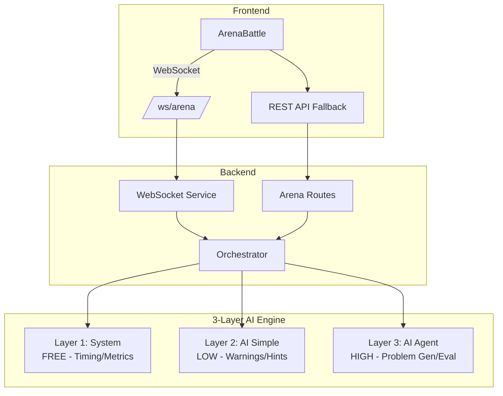

# NovaxArena System Implementation Walkthrough

## Overview

Sistem EXP, Level, Archetype, dan AI Engine untuk problem-solving dengan mentor AI yang interaktif.

---

## Architecture



---

## Key Features

### 1. Dynamic Question Box (bukan Chat)
- AI pertanyaan muncul di box "Jawab Pertanyaan Ini:"
- Pertanyaan berganti dynamically berdasarkan respon user
- Flow: Initial → Follow-up → Stress Test → Conclusion

### 2. Role Labels (bukan Archetype)
- Problem sekarang punya `role_label`: CEO, Product Manager, Engineer, dll
- Ditampilkan dengan badge violet

### 3. WebSocket Real-time
- Keystroke tracking tanpa polling
- AI interventions langsung push ke client
- Fallback ke REST jika WebSocket gagal

### 4. Multi-Step Conversation
- Tidak 1 submit selesai
- AI terus bertanya sampai menentukan sudah cukup
- Minimum 3 exchange sebelum bisa selesai

---

## Files Changed

### New Files (Backend)
| File | Purpose |
|------|---------|
| `services/websocketService.js` | WebSocket server untuk real-time |
| `services/systemLayerService.js` | Layer 1 - timing, metrics |
| `services/aiSimpleService.js` | Layer 2 - warnings, hints |
| `services/orchestratorService.js` | Koordinator 3 layer |
| `models/ArenaSessionMetrics.js` | Real-time tracking |
| `models/SessionMemory.js` | AI context storage |

### Modified Files
| File | Changes |
|------|---------|
| `server.js` | WebSocket integration |
| `models/UserProfile.js` | Per-archetype levels |
| `models/Problem.js` | role_label field |
| `services/aiService.js` | Personalized problem gen |
| `routes/mentorRoutes.js` | follow-up, stress-test, hint |
| `components/arena/ArenaBattle.jsx` | Dynamic question box |
| `components/arena/ProblemCard.jsx` | Show role_label |

---

## API Endpoints

| Endpoint | Method | Purpose |
|----------|--------|---------|
| `/api/mentor/follow-up` | POST | Generate follow-up question |
| `/api/mentor/stress-test` | POST | Generate stress test |
| `/api/mentor/hint` | POST | Generate hint |
| `/api/arena/init-session` | POST | Initialize orchestrator |
| `/ws/arena` | WebSocket | Real-time communication |

---

## Testing

```bash
# Backend
cd Prototype-to-MVP-backend
npm run dev

# Frontend  
cd Prototype-to-MVP-frontend
npm run dev
```

Akses Arena → Generate Problem → Lihat role label dan dynamic question box.

---

## Cost Estimation Per Session

| Component | Calls | Cost |
|-----------|-------|------|
| Problem Generation | 1 | ~$0.01 |
| Initial Question | 1 | ~$0.0005 |
| Follow-ups | 2-4 | ~$0.002 |
| XP Evaluation | 1 | ~$0.01 |
| **Total** | - | **~$0.025** |
